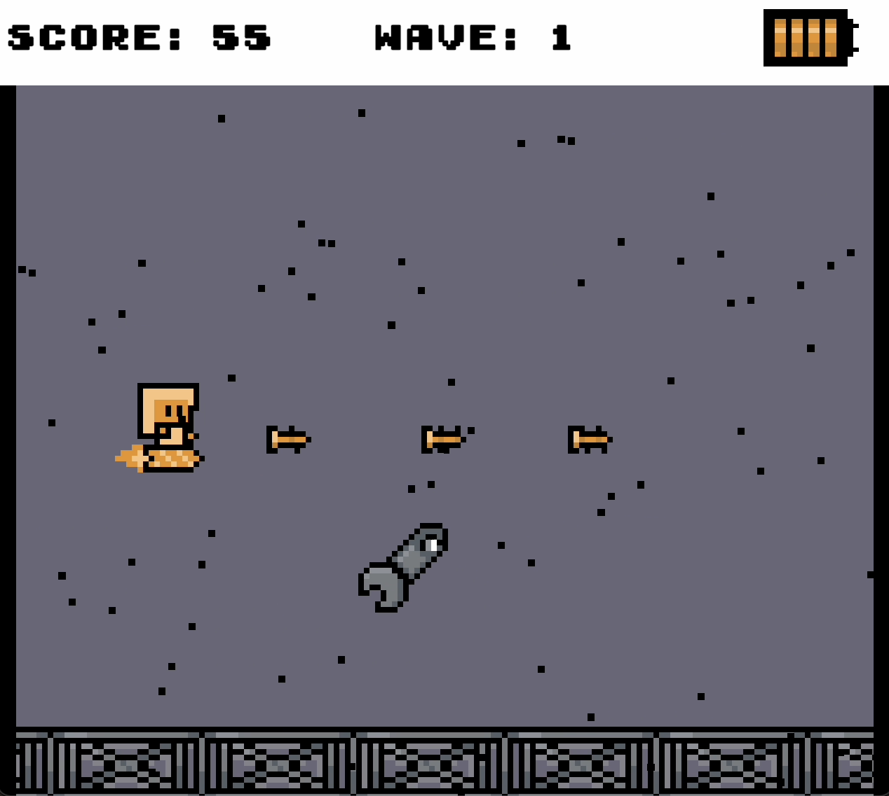
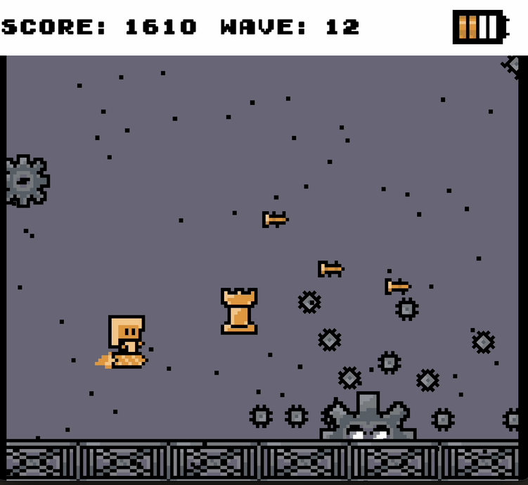

# The Adventures of Super Cool Carrot Rocket Chessmaster Girl

Submitted for [McGameJam 2024](https://itch.io/jam/mcgamejam-2024/entries) (Theme: Contraption) and Awarded Best Gameplay by Ubisoft

Find the game on [Itch.io](https://lianl.itch.io/the-adventures-of-super-cool-carrot-rocket-chessmaster-girl)!
Watch a demo [here!]([https://lianl.itch.io/the-adventures-of-super-cool-carrot-rocket-chessmaster-girl](https://www.youtube.com/watch?v=ISyCelCeTNc&ab_channel=Lian))!

Made using Unity

"The adventures of super cool carrot rocket chessmaster girl and her platonic friendzoned acquaintance Ken (he didn't want to join in but he was forced to) in their quest to build like contraptions or something to fight against the metal gears and wrenches of the living of the night of the triplet machines" is a schmup inspired game. 

Super cool carrot rocket chessmaster girl is a super cool carrot rocket chessmaster girl and she and her acquaintance Ken needs to fights against the silly metal gears and wrenchs that are invading their robotic country. While she is a super cool carrot rocket chessmaster girl, Ken is just a guy and he doesn't want to be there. (He is not a patriot.) However, using the power of chess, they might be able to protect their country for a while. Not for long though since they are only two against maybe a million or something. It's hard to accept, but they will die eventually... R.I.P super cool carrot rocket chessmaster girl, we'll never forget you! NEVER! 

We hope you'll enjoy this simple high score schmup game!!!  

### Controls:
- **Player 1:** WASD + Space
- **Player 2:** Arrow keys + period button

### Gameplay Overview:
- **Goal:** Survive! As long as possible with your 4 lives
- **Hats:** Collect and try on chess-inspired hats to improve your shooting patterns!
- **Pawns:** Pawns stick to you and other pawns, allowing you to build up your contraption! They only shoot diagonally.

### Screenshots:

        
        

        
        

        
        

        
        

